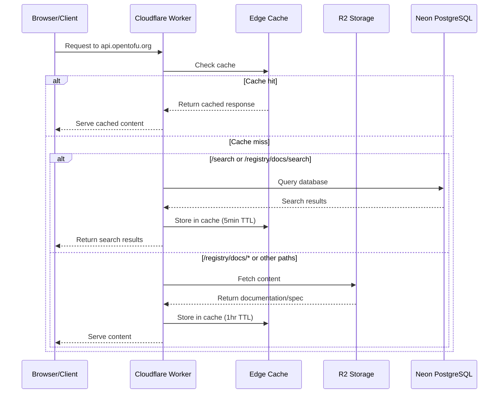

# Search Worker

## What it does

The search worker is a Cloudflare Worker that serves as the main entry point for api.opentofu.org. It handles both search functionality and serves static content for the OpenTofu Registry.

> **Note on naming**: Despite being called "search worker," this component has evolved beyond its original purpose. It started as just a search service but now serves as the frontend for the entire api.opentofu.org domain, handling both search and content delivery.

## Dual purpose

1. **Search API**: Connects to Neon PostgreSQL for search queries
2. **Content delivery**: Serves documentation and API spec from Cloudflare R2 storage

## How content serving works

When you access api.opentofu.org:

- Requests to `/registry/docs/search` or `/search` run database queries
- Requests to `/registry/docs/*` fetch content from the R2 bucket
- The R2 bucket contains documentation scraped by the registry backend
- The OpenAPI specification is served from R2 at the root URL

The R2 bucket mimics a REST API structure. You can fetch the OpenAPI spec from https://api.opentofu.org/ to understand the full API structure.

## How search works

The search functionality:
- Accepts a query parameter (`?q=searchterm`)
- Queries the Neon PostgreSQL database
- Returns search results to be used by search.opentofu.org

## Caching

The worker implements a two-tiered caching strategy:

1. **Search results**: Cached at the edge for 5 minutes
2. **Static content**: Cached at the edge for 1 hour

## Architecture

